  

<h1 align="center">Hi 👋 I'm Thanapol (Film)</h1>

<h3 align="center">
Data Analytics Engineer • Python Developer • Computer Science Graduate
</h3>

Building data-driven applications with Python, SQL, ETL, and AI.

---

# 👨‍💻 About Me

🎓 Computer Science graduate from **Burapha University**

📊 Passionate about **Data Engineering, Data Analytics, and Artificial Intelligence**

🐍 Experienced in building applications using **Python, SQL, ETL, Machine Learning, and Data Visualization**

🤖 Interested in solving real-world problems with data-driven solutions, automation, and AI-powered systems

🌱 Currently improving my skills in **Cloud Technologies, Data Engineering, and Backend Development**

---

# 🚀 What I'm Working On

- 📈 Data Analytics Projects
- 🏗️ ETL Pipelines
- 📊 Interactive Dashboards
- 🤖 AI Applications
- 🐍 Python Development

---

# 💼 Featured Projects

## 📄 Regulation Document Retrieval System

AI-powered search engine for Thai regulation documents.

### Highlights

- OCR
- LangChain
- Vector Database
- Semantic Search
- LLM Integration

**Tech Stack**

`Python` `SQLite` `LangChain` `Qdrant` `OCR`

---

## ☕ Coffee Shop Data Warehouse

Designed an ETL pipeline and Data Warehouse for business analytics.

### Features

- ETL Pipeline
- Star Schema
- Sales Analytics
- Dashboard Reporting

**Tech Stack**

`Python` `SQL` `SQLite` `Power BI`

---

## 🛒 Sales Analytics Dashboard

Business Intelligence dashboard for monitoring sales performance.

**Tech Stack**

`Power BI` `SQL`

---

# 🛠 Tech Stack

### Languages

### Data

### AI

### Development

---

# 📈 GitHub Stats

---

# 🌐 Connect with Me

---

---

<h3 align="center">

Turning raw data into meaningful insights.

</h3>
